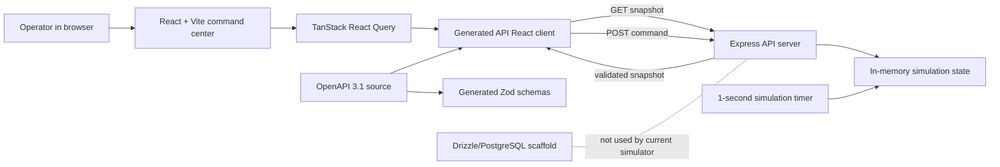
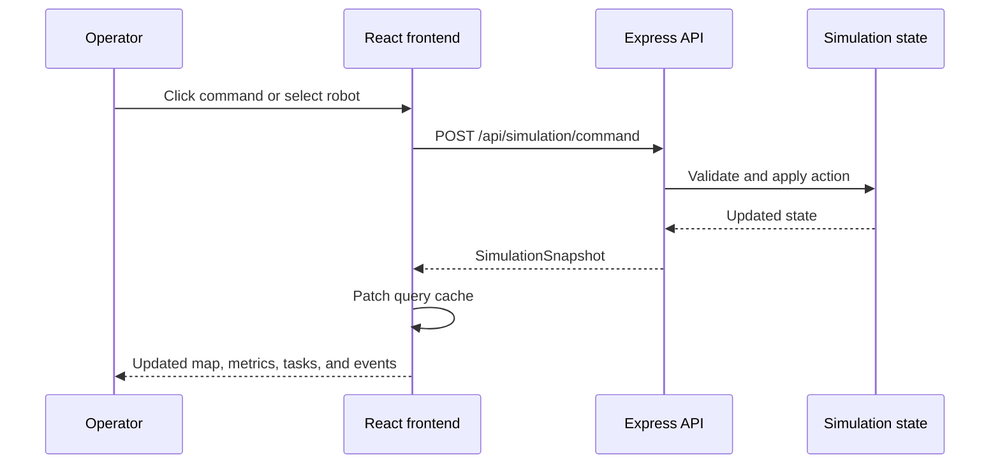

# Architecture

## System overview

## Frontend

The web artifact is in `artifacts/multi-robot-engine`.

- `src/App.tsx` contains the dashboard shell, route navigation, map, robot details, task rail, event stream, and command handlers.
- `src/index.css` contains the dark Akatsuki command-center theme, isometric floor, walls, hologram labels, route animations, robot markers, and responsive styles.
- React Query polls `/api/simulation/snapshot` every second and updates the dashboard from the returned snapshot.
- Mutations post commands to `/api/simulation/command`, then update the React Query cache immediately with the returned snapshot.
- The map is a CSS/SVG scene rather than a heavy 3D runtime. This keeps the 500-marker Prototype 1 view responsive while still providing perspective and interactive navigation.

## Backend

The API artifact is in `artifacts/api-server`.

- Express mounts all routes under `/api`.
- `src/routes/simulation.ts` owns the complete simulator state machine.
- The simulator advances every second while running.
- Robot positions are interpolated along shared lane polylines.
- Prototype 2 uses a slower movement rate and a 48-robot fleet.
- Commands mutate the in-memory state and return the updated, schema-validated snapshot.
- Task telemetry is emitted periodically into the event stream with status, destination, and ETA.

## State lifecycle

1. The API starts with a seeded `newState()` object.
2. The simulation timer advances active robots and battery values.
3. The frontend polls the snapshot.
4. The operator selects a robot or invokes a command.
5. The API applies the command, adds an event when appropriate, and returns a new snapshot.
6. The frontend patches the React Query cache and renders the result.
7. Restarting the API recreates the in-memory state. This is intentional for the current demonstration.

## Command flow

## Deployment

The frontend artifact is configured as a static Replit web artifact in `artifacts/multi-robot-engine/.replit-artifact/artifact.toml`.

- Build command: `pnpm --filter @workspace/multi-robot-engine run build`
- Static output: `artifacts/multi-robot-engine/dist/public`
- SPA rewrite: all paths rewrite to `/index.html`
- Public deployment URL: `https://multi-robot-task-negotiation-engine--sharoonsathu.replit.app`

The API runs as the separate `artifacts/api-server: API Server` workflow in development. Production routing is managed by the Replit artifact configuration.